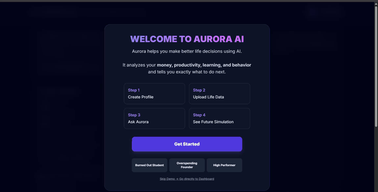

# Aurora AI — Autonomous Life Strategist

Aurora AI — Decision Intelligence System

Aurora AI is a decision‑intelligence system that helps you make better life choices using data from across your daily life. Instead of just tracking information, it analyzes your finances, productivity, and behavior to determine whether a decision is actually beneficial in the long run.

Live Demo: https://aurora-ai-o2f6.onrender.com/

What Aurora Does

Aurora allows users to input their current state through manual entry or by uploading documents such as bank statements, expense reports, or habit logs.

Users can then ask real‑world questions like:

"Should I buy this $40,000 car?"
"Can I afford to take a pay cut for my dream job?"
"Should I work tonight or take a break?"

Aurora performs structured reasoning by:

Extracting financial and behavioral signals from user data

Evaluating stability using a custom Life Instability Index

Simulating short‑term outcomes of decisions

Identifying risks such as financial strain, burnout, or loss of progress

The system outputs a clear Yes / No / Caution decision, along with reasoning, risks, and suggested alternatives. It can also ask follow‑up clarification questions when input is incomplete.

How It Works — Multi‑Agent Decision System

Aurora uses a multi‑agent architecture where specialized AI components evaluate decisions from different perspectives:

Finance Agent
Analyzes income, expenses, savings, and financial risk.

Productivity Agent
Evaluates focus, workload, and consistency toward goals.

Bio‑Behavior Agent
Tracks energy levels, recovery, and burnout risk.

Each agent independently evaluates the decision and contributes a perspective. A central orchestrator combines these into a final structured output, making Aurora behave more like a decision engine than a traditional chatbot.

Tech Stack

Frontend: HTML, CSS, TailwindCSS, JavaScript
Backend: FastAPI, Python
AI Layer: Gemini API (multi‑agent orchestration)
Data Processing: NumPy, OpenCV, RapidOCR, PyPDF
Deployment: Render
Other: Pydantic, Uvicorn

Setup

Option 1 — Quick Start (Windows)

Run:
start_aurora.bat

Add your Gemini API key to:
backend/.env

Option 2 — Manual Setup

Backend:
cd backend
pip install -r requirements.txt
python main.py

Frontend:
Open frontend/index.html

Why Aurora Is Different

Most tools track isolated metrics like money, habits, or productivity.
Aurora connects these domains and answers a harder question:

"What should I actually do next?"

It transforms raw data into structured decisions, acting as a personal decision engine rather than a dashboard.

Future Improvements

Integration with real‑time data (calendars, banking, wearables)

Improved long‑term prediction and scenario simulation
